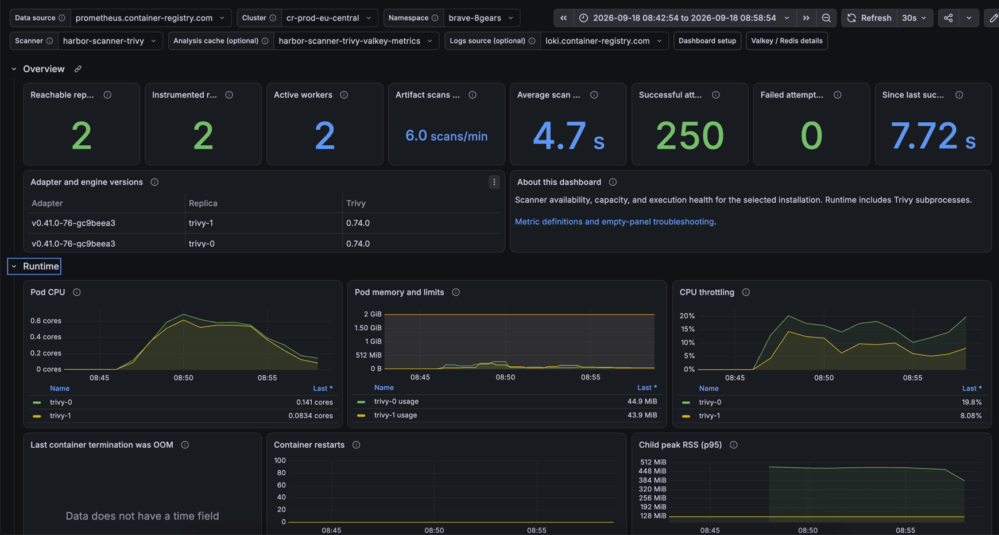

# Multiple pods with Redis

Throughput comes from replicas. Each pod runs one worker and one Trivy
process with its own vulnerability DB volume; `workerConcurrency` other than
`1` is rejected. Two Redis/Valkey connections are involved and must stay
separate:

| Values | Instance | Stores | Eviction |
| --- | --- | --- | --- |
| `redis.*` | Harbor's existing Redis/Valkey (6.2+) | Job queue (Streams), job state, reports | Must not evict |
| `valkey.*` | Dedicated Valkey from this chart | Trivy image/layer analysis shared by all pods | `allkeys-lru`, 512 MiB by default |

With the shared cache, a layer analyzed by one pod is not pulled or analyzed
again by the others.

## Values

[`values.yaml`](values.yaml) runs three pods. Start with two or three and add
pods while CPU, registry bandwidth and the cache have headroom. Scaling up adds
one PVC per pod and a one-time DB download.

The job Redis URL is read from a Secret, so the password never reaches the pod
spec:

```sh
kubectl -n harbor create secret generic harbor-scanner-trivy-redis \
  --from-literal=url='redis://:s3cr3t@harbor-redis:6379/5'
```

Sentinel works for the job connection
(`redis+sentinel://:s3cr3t@sentinel-a:26379,sentinel-b:26379/mymaster/5`),
not for the analysis cache.

To use an external analysis cache instead of the bundled one, set
`valkey.enabled: false` and point `trivy.cacheBackend` at it, or pass a
credential URL through a Secret:

```yaml
extraEnv:
  - name: SCANNER_TRIVY_CACHE_BACKEND
    valueFrom:
      secretKeyRef:
        name: trivy-analysis-cache
        key: url
```

The same override is required when `valkey.auth.enabled` is set. TLS, ACL and
upgrading from Pub/Sub releases are covered in the
[scaling guide](../../../../docs/SCALING.md).

## Grafana dashboards

`metrics.grafanaDashboard.enabled` ships the Trivy and Valkey dashboards as a
ConfigMap for the Grafana sidecar; `metrics.serviceMonitor` and
`valkey.metrics.serviceMonitor` feed them (Prometheus Operator required). Enable
the dashboard ConfigMap on one release per Grafana organization. Select Cluster,
Namespace and Scanner, then pick the Valkey exporter under Analysis cache.



Watch scans per minute, average scan duration, the oldest queued delivery and
cache evictions when deciding whether another pod helps. See the
[dashboard guide](../../dashboards/README.md) for every panel.
