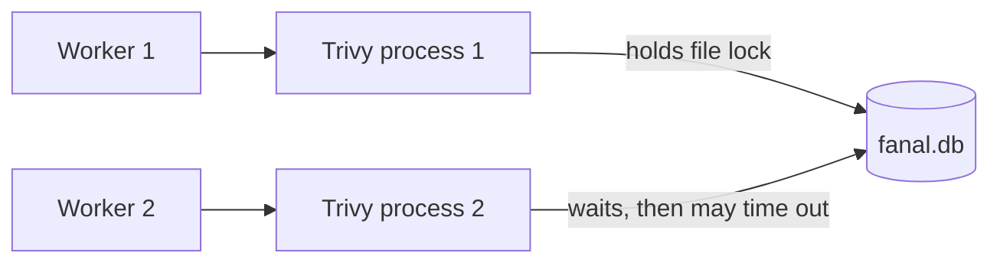
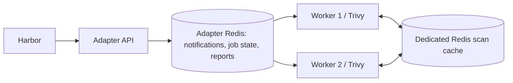

# Multiple workers and the Trivy scan cache

This analysis was prepared on 2026-09-09 from adapter commit `9891e7a`, which pins Trivy `0.74.0`. It covers source behavior; production workload and Redis capacity benchmarks were outside the investigation.

The adapter has since moved to one worker per pod and durable Redis Streams, and now forwards its cache settings to Trivy. The configuration gaps and Pub/Sub behavior below apply to the inspected commit. For current deployment settings and validation results, use the [scaling guide](SCALING.md). Current releases use `SCANNER_TRIVY_CACHE_*` in place of the native `TRIVY_*` overrides discussed here.

At that commit, the adapter could start multiple workers, but its filesystem scan cache prevented them from reliably scanning images against the same cache directory. Redis removes that shared-file lock and allows workers across pods to reuse analysis. Redis memory will not equal the size of `fanal.db`: retention, database overhead, and replication determine the difference.

## How workers operated at the baseline commit

`SCANNER_JOB_QUEUE_WORKER_CONCURRENCY` controls goroutines per adapter process, defaulting to one. Each consumes from a shared subscription channel, claims a job using Redis `SET NX`, and calls the scan controller. The controller runs a separate `trivy` subprocess for that job and writes its report back to Redis. Temporary report filenames are unique per scan. See [worker.go](https://github.com/container-registry/harbor-scanner-trivy/blob/9891e7a/pkg/queue/worker.go), [controller.go](https://github.com/container-registry/harbor-scanner-trivy/blob/9891e7a/pkg/scan/controller.go), and [wrapper.go](https://github.com/container-registry/harbor-scanner-trivy/blob/9891e7a/pkg/trivy/wrapper.go).

Workers could be added within a pod or across pods:

| Layout | Potential simultaneous scans | Cache consequence |
| --- | --- | --- |
| One pod, one worker | 1 | Default local cache works |
| One pod, four workers | Up to 4 | All subprocesses currently use the same cache directory |
| Four pods, one worker each | Up to 4 | Separate pod volumes avoid the shared-file lock, but duplicate cached analysis |
| Four pods, one worker each, Redis cache | Up to 4 | Shared analysis; local vulnerability databases remain isolated per pod |
| Two pods, two workers each, Redis cache | Up to 4 | Scan-cache lock removed; concurrent local database initialization and updates still need handling |

These layouts provide execution slots. Actual throughput also depends on Harbor submitting enough work and on the available CPU, memory, temporary storage, registry bandwidth and cache latency. Each Trivy process can also parallelize its own work. Increasing adapter workers multiplies that resource demand.

Pub/Sub broadcasts each job to every subscribed adapter, and a Redis job lock decides which replica executes it. Replicas must use the same job/store configuration and namespaces. This baseline uses subscriptions without Redis consumer groups. [Enqueuer implementation](https://github.com/container-registry/harbor-scanner-trivy/blob/9891e7a/pkg/queue/enqueuer.go)

## Why fanal.db obstructs concurrency

Trivy holds an exclusive process-level lock on `fanal.db` for as long as the writable BoltDB database is open. Another Trivy process using that file must wait. In v0.74.0, it fails after approximately five seconds if it cannot acquire the lock. See the [filesystem cache implementation](https://github.com/aquasecurity/trivy/blob/v0.74.0/pkg/cache/fs.go).



Adding workers can therefore cause cache-lock failures. Increasing PVC capacity leaves this locking behavior unchanged. Giving each worker its own cache directory would avoid it, but requires adapter changes for workers within one process and duplicates local cache assets. The chart already gives replicas their own volumes by default. [Trivy troubleshooting](https://trivy.dev/docs/latest/references/troubleshooting/)

The file also has no automatic TTL or capacity eviction. Registry deletion and garbage collection do not prune it. BoltDB retains freed pages within its file instead of automatically returning that space to the filesystem. This creates a separate capacity problem even with only one worker. [BoltDB limitations](https://github.com/etcd-io/bbolt#caveats--limitations)

## What Redis improves



Trivy's Redis backend stores artifact and layer analysis under `fanal::...` keys. Independent scan processes can access them without locking a common database file. Identical cache keys are shared across workers and replicas. Concurrent cold misses can still cause duplicate analysis; this backend does not provide a distributed lock for building each layer entry.

Trivy sets expiration when writing an entry. A normal read does not refresh its TTL. A zero TTL means no expiration, so selecting Redis alone does not solve historical growth. Redis cache writes are uncompressed JSON, just like filesystem cache values. The adapter's gzip compression of Harbor reports does not apply to this separate cache. [Trivy Redis implementation](https://github.com/aquasecurity/trivy/blob/v0.74.0/pkg/cache/redis.go)

Redis also supports a memory budget and eviction policy. For a dedicated, disposable scan-cache instance, `maxmemory` plus an LRU policy is a reasonable starting point. TTL limits age; eviction handles bursts exceeding the budget. Leave RAM beyond `maxmemory` for process overhead and any persistence/replication buffers. [Redis eviction documentation](https://redis.io/docs/latest/develop/reference/eviction/)

Use a separate Redis instance for this cache where practical. The adapter's existing Redis contains job locks, state, and reports that must remain available until consumed. A cache eviction policy on that same instance can remove those records. Logical Redis databases separate keys while sharing the server's memory budget and eviction policy. Even a volatile policy can select adapter records because those records also have TTLs. This recommendation follows from the adapter's [store implementation](https://github.com/container-registry/harbor-scanner-trivy/blob/9891e7a/pkg/persistence/redis/store.go) and Redis's server-wide eviction configuration.

Scans now depend on Redis availability and incur network latency. If an entry expires or is evicted between a cache check and layer application, the scan may fail with a missing-layer error. Include this case in memory-pressure tests. Cache write errors can fail scans. Keep enough capacity for active scans and useful reuse.

## Configuration gap at the inspected commit

The chart has `trivy.cacheBackend`, `cacheTTL`, `cacheMaxSize`, and Redis TLS values, rendering `SCANNER_TRIVY_CACHE_*` variables. It rejects multiple workers with the `fs` chart setting. However, at the inspected commit, [config.go](https://github.com/container-registry/harbor-scanner-trivy/blob/9891e7a/pkg/etc/config.go) has no corresponding backend/TTL/size fields, and [wrapper.go](https://github.com/container-registry/harbor-scanner-trivy/blob/9891e7a/pkg/trivy/wrapper.go) passes none of those flags. The chart's backend selection, seven-day TTL, and 3 GiB filesystem cap are therefore not implemented by this adapter code. See [values.yaml](https://github.com/container-registry/harbor-scanner-trivy/blob/9891e7a/deploy/chart/values.yaml) and [environment rendering](https://github.com/container-registry/harbor-scanner-trivy/blob/9891e7a/deploy/chart/templates/_helpers.tpl).

The inspected binary can use Redis through its inherited environment: Trivy reads `TRIVY_CACHE_BACKEND` and `TRIVY_CACHE_TTL` directly. The following example was prepared for evaluation and was neither deployed nor load tested. Replace the hostname with a provisioned cache service:

```yaml
replicaCount: 2
jobQueue:
  workerConcurrency: 1

# Keep chart validation and declared intent aligned with the actual backend.
trivy:
  cacheBackend: redis://trivy-scan-cache:6379/0
  cacheTTL: 168h

# These native Trivy variables are what the inspected binary actually uses.
extraEnv:
  - name: TRIVY_CACHE_BACKEND
    value: redis://trivy-scan-cache:6379/0
  - name: TRIVY_CACHE_TTL
    value: 168h
```

For authenticated Redis, supply the native backend variable using `valueFrom.secretKeyRef`. Native TLS flags likewise bind to `TRIVY_REDIS_TLS`, `TRIVY_REDIS_CA`, `TRIVY_REDIS_CERT`, and `TRIVY_REDIS_KEY`. The Trivy backend accepts a single-node Redis URL, not the adapter's Sentinel URL format. [Flag definitions](https://github.com/aquasecurity/trivy/blob/v0.74.0/pkg/flag/cache_flags.go), [environment binding](https://github.com/aquasecurity/trivy/blob/v0.74.0/pkg/flag/options.go)

An implementation that closes this gap needs to parse the chart's adapter settings, validate the effective backend against worker concurrency, and pass the supported Trivy options explicitly. Backend URLs must be redacted in the wrapper's command logging if passed as arguments. Filesystem capacity cleanup requires its own implementation; Trivy's Redis TTL does not implement the chart's filesystem size cap.

## Would Redis be the same size as fanal.db?

Compare the same retained records when sizing the two backends. There is no fixed conversion between their storage requirements:

```text
fanal.db disk bytes = retained JSON + keys + B-tree pages + free/slack pages

Redis primary RAM = retained JSON + keys + Redis objects/expiry metadata
                  + allocator overhead + server/client buffers
```

For identical entries and versions, the serialized value payload is comparable. Redis can use more memory than a compact BoltDB file because of per-key and allocator overhead. An old BoltDB file can instead be much larger because it contains obsolete entries and unused pages. TTL can reduce the Redis dataset substantially by retaining a shorter period of scan history. The difference depends on the retained data and storage overhead, so a universal conversion percentage would be misleading.

Replicas of the Redis server each hold another dataset copy. Redis RDB/AOF disk usage is a third measurement, distinct from Redis RAM and `fanal.db` disk usage. Adding adapter workers does not multiply shared cache entries for identical keys, though faster scanning of new content can increase the rate at which new keys arrive.

For a sizing example, suppose the workload writes 10,000 distinct layer entries per day averaging 100 KiB of JSON, and entries remain for seven days without eviction, their payload is about 6.7 GiB. Image-level records and all memory overhead come on top. At that same hypothetical rate, 90 days of retained history would hold about 85.8 GiB of layer payload. Shorter retention accounts for that reduction; Redis stores the same uncompressed JSON. Actual repeated-key writes, TTL expiry, workload variation, and eviction change these figures.

To size a real deployment:

1. Use a dedicated test cache and a representative mix of images. Record empty-instance memory, then run cold and warm scans at one, two, and four workers.
2. Sample `fanal::*` keys using `SCAN`, measuring `STRLEN`, `MEMORY USAGE`, and `TTL`. Include large and small records; avoid assuming a handful of keys represents the dataset.
3. Track `INFO memory` (`used_memory`, `used_memory_dataset`, `used_memory_rss`) and `INFO stats` (`evicted_keys`, `expired_keys`, cache hits/misses). Compare before/after deltas and process RSS, not just serialized bytes.
4. Observe at least one full intended retention cycle and a bulk-scan peak. Account separately for Redis replicas, buffers, and optional persistence.
5. Compare with a consistent, offline BoltDB snapshot's live key/value bytes and free-page statistics. File length alone cannot estimate Redis RAM.

[MEMORY USAGE](https://redis.io/docs/latest/commands/memory-usage/) includes allocation overhead for a key; [INFO](https://redis.io/docs/latest/commands/info/) exposes aggregate memory and operational metrics. Monitor worker success rate and scan latency alongside cache size: an undersized cache may save RAM while making scans slower or less reliable.

## Remaining limits before a broad rollout

Redis caching removes the shared analysis-file lock. The inspected commit has other limits that need validation or changes:

| Concern | Evidence and implication |
| --- | --- |
| Local vulnerability databases | Redis does not move `trivy.db`, the Java database, or other downloaded assets. Exercise simultaneous cold starts and database refreshes. Consider coordinated refresh and read-only scanning against prepared assets; disabling updates requires an ongoing freshness mechanism. |
| Pub/Sub delivery | Notifications are not durable. Disconnects or unavailable subscribers can lose jobs; storing a job status does not implement replay. A durable queue with acknowledgements and recovery would improve reliability. |
| Fixed five-minute claim | `worker.go` sets a five-minute lock with no renewal or completed-job check before scanning. A delayed subscriber may acquire an expired claim and repeat a job, including while a long scan is still running. Expiration alone does not trigger retry. |
| Job/report expiry | The derived TTL is `2 * scan timeout + 3s`. The worker has no enforced maximum queue wait, so this formula does not guarantee survival under an arbitrary backlog. Admission control, durable scheduling, or explicit queued-job lifetime handling is needed. |
| Shutdown | `worker.Stop()` closes the subscription but does not join active workers. The subprocess uses `exec.Command`, not a context-bound command. Test draining and termination during scans. |
| Resource saturation | Per-worker CPU, memory, temporary disk, and registry load remain. Set worker count from measured throughput and failure rates, not CPU count alone. |

The local findings above follow from [worker.go](https://github.com/container-registry/harbor-scanner-trivy/blob/9891e7a/pkg/queue/worker.go), [config.go](https://github.com/container-registry/harbor-scanner-trivy/blob/9891e7a/pkg/etc/config.go), [wrapper.go](https://github.com/container-registry/harbor-scanner-trivy/blob/9891e7a/pkg/trivy/wrapper.go), and [main.go](https://github.com/container-registry/harbor-scanner-trivy/blob/9891e7a/cmd/scanner-trivy/main.go). Redis documents its [Pub/Sub delivery semantics](https://redis.io/docs/latest/develop/pubsub/). Trivy initializes local databases in its [scan runner](https://github.com/aquasecurity/trivy/blob/v0.74.0/pkg/commands/artifact/run.go).

Start evaluation with a dedicated Redis scan cache and two pods with one worker each, each using its own database volume. Verify that Trivy logs the Redis backend, then compare cold/warm throughput and peak resource use. Test cache pressure, database refresh, long scans, and worker restarts before expanding replicas. Switching backends leaves the old `fanal.db` on disk; reclaim it separately when no filesystem-cache scans are using it. Measure capacity and throughput on the actual workload before choosing production settings.

## Recommended path to high throughput

For the current subprocess architecture, scale replicas with one worker each and separate local database volumes. Share analysis through a dedicated Redis cache. Start at two replicas and compare four replicas against the same workload before increasing further. This avoids simultaneous local database users within a pod while preserving cross-pod layer-cache reuse. Trivy's [lock troubleshooting guidance](https://trivy.dev/docs/latest/references/troubleshooting/#database-and-cache-lock-errors) covers both scan-cache and vulnerability-database conflicts; changing only the scan-cache backend is not a complete local-database concurrency strategy.

For repeated vulnerability scans, enable `SCANNER_TRIVY_USE_SBOM_ACCESSORY` and establish a workflow that generates compatible Harbor SBOM accessories for image digests. The adapter can then scan the inventory against current vulnerability data without pulling and analyzing image layers again. This flag does not itself generate missing SBOMs. It falls back to image scanning, and SBOM generation, secret scanning, and misconfiguration scanning still require image content. Rebuild inventories when analyzer improvements require newly discovered information. See [the accessory path](https://github.com/container-registry/harbor-scanner-trivy/blob/9891e7a/pkg/trivy/wrapper.go) and [target selection](https://github.com/container-registry/harbor-scanner-trivy/blob/9891e7a/pkg/trivy/target.go).

Reliable bulk scanning also needs durable delivery with acknowledgements and recovery, renewable ownership, and job lifetimes that account for queue backlog. Fix the chart-to-adapter cache configuration gap as part of that work. Measure completed scans per minute, failure rate, cold/warm latency, registry bytes transferred, and Redis peak memory. Choose TTL around observed reuse intervals with margin; a TTL shorter than the rescan interval defeats reuse, while ordinary cache reads do not extend the configured lifetime.

A separate Trivy server tier is a later option if repeated vulnerability-database initialization and distribution are significant bottlenecks. In client/server mode, servers own and refresh the vulnerability database, while clients perform image analysis and request vulnerability matching remotely. Multiple server instances should share Redis analysis caching and retain separate local database volumes. This can separate scaling of analysis from matching, but it does not eliminate client-side work or guarantee higher throughput. [Trivy client/server mode](https://trivy.dev/docs/latest/references/modes/client-server/), [shared cache backends](https://trivy.dev/docs/latest/configuration/cache/)

Adopting server mode requires adapter integration work: verify image scans, SBOM generation, SBOM accessory scans, credentials, enabled scanners, and findings parity before switching. Keep the replica architecture unless measurements show a benefit from adding the server tier.
